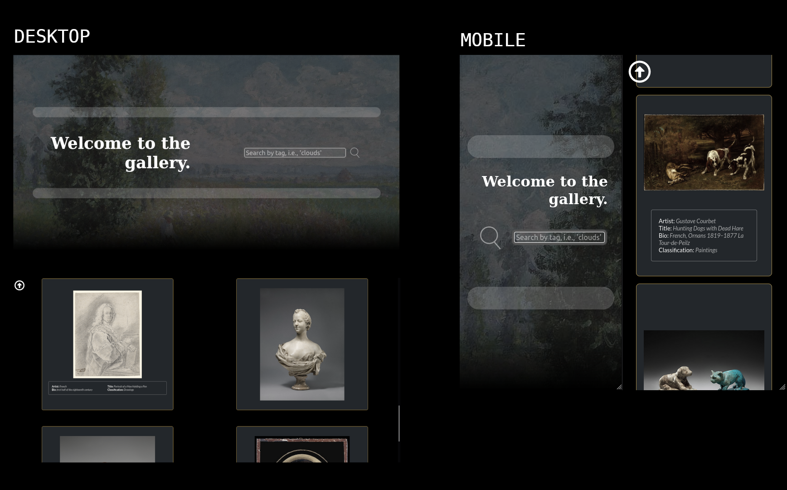

# Art gallery
The Metropolitan Museum collection gives you access to thousands of works for you to browse. Click on a piece to learn more about it, or keep scrolling to get more. Just write the author name, nationality, category, or a random word and, you'll get related pieces of art.

## Screenshots 📷

## Live Demo 🔴
You can see my page live here: 
[Check it out!](https://art-gallery-react.netlify.app/)

## Preview 🎥

### Mobile

### Desktop

## Built With 🔨
- SCSS
- javaScript
- React
- Framer

## Getting Started
To get a local copy running follow this steps!
- Press the "Code" button and copy the link.
- Clone it using git command `git clone <link>`.
- Go to the directory `cd <repo-name>`
- `npm install` to install the packages
- `npm run start` to build dist files and run local server.

## Testing 
- `npm test` Launches the test runner in the interactive watch mode.
## Author

👤 *Gabriel Rendon*

- GitHub: [@gabrielyea](https://github.com/gabrielyea)
- Linkedin [Gabriel Rendon](https://www.linkedin.com/in/gabriel-rendon-paredes/)

## 🤝 Contributing

Contributions, issues, and feature requests are welcome!

## Show your support

Give a ⭐️ if you like this project!

## Acknowledgments

This project uses the [Metropolitan Museum Of Art Collection API](https://metmuseum.github.io/)
